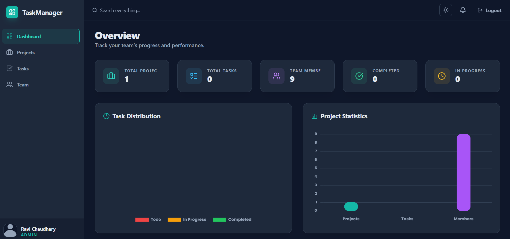
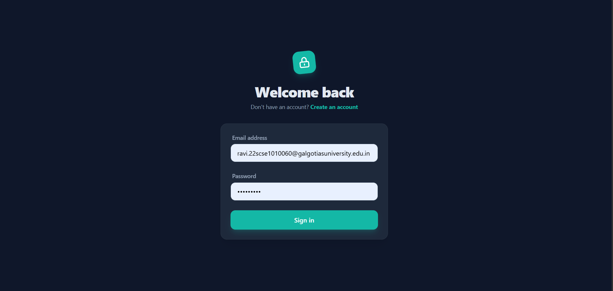
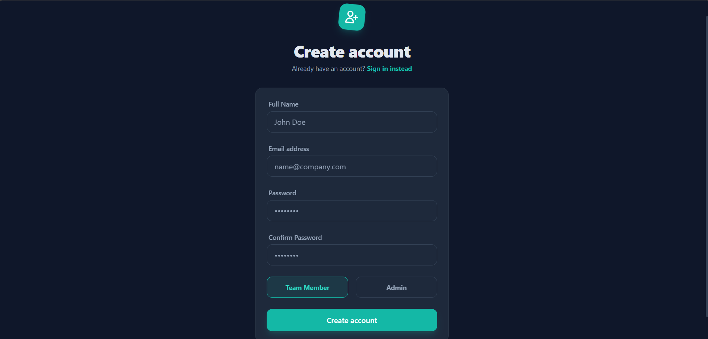

# Team Task Manager 

A modern full-stack task management platform built for teams to organize projects, manage tasks, and track progress smoothly.
This project focuses on clean UI, role-based access, and real-world team collaboration features.

## Home Page


Modern landing page with a clean hero section, authentication buttons, and smooth dark-themed UI.

---

## Dashboard Preview



Interactive dashboard showing:

* Project statistics
* Team performance
* Task distribution
* Progress tracking

---

## Login Page



Simple and secure authentication system with JWT-based login.

---

## Signup Page



Users can register either as:

* Admin
* Team Member

#  Tech Stack

## Frontend

* React.js
* Tailwind CSS
* Redux Toolkit
* Axios
* Chart.js

## Backend

* Node.js
* Express.js

## Database

* SQL

## Authentication

* JWT Authentication
* bcryptjs Password Hashing

---

# Features

### Authentication System

* Secure Signup & Login
* JWT-based authentication
* Protected routes

### ✅ Role-Based Access Control

Two user roles:

* **Admin**
* **Member**

Admins have full control while members have limited permissions.

### ✅ Project Management

Admins can:

* Create projects
* Edit projects
* Delete projects
* Manage project details

### ✅ Task Management

* Create tasks
* Assign tasks to team members
* Update task status
* Delete tasks
* Track progress

#  Folder Structure
Task Manager/
├── backend/                
│   ├── src/
│   │   ├── config/         
│   │   ├── controllers/    
│   │   ├── middleware/     
│   │   ├── models/         
│   │   ├── routes/        
│   │   ├── utils/          
│   │   ├── app.js          
│   │   └── index.js        
│   ├── .env                
│   └── package.json        
├── frontend/               
│   ├── src/
│   │   ├── api/           
│   │   ├── components/     
│   │   ├── context/       
│   │   ├── pages/          
│   │   ├── store/          
│   │   ├── App.jsx         
│   │   ├── index.css      
│   │   └── main.jsx        
│   ├── tailwind.config.js 
│   ├── vite.config.js     
│   └── package.json        
└── README.md               


# Installation & Setup

# Backend Setup

```bash
cd backend
npm install
```

Create a `.env` file:

```env
PORT=5000
JWT_SECRET=your_secret_key
```

Run backend:

```bash
npm run dev
```

---

# Frontend Setup

```bash
cd frontend
npm install
npm start
```

Open:

```bash
http://localhost:3000
```

#  Future Improvements

* Real-time notifications
* File attachments
* Team chat system
* Drag & Drop Kanban board
* Email notifications
* Dark/Light theme toggle

---

# Author

**Ravi Chaudhary**


---

#  If you like this project

Give it a star on GitHub and feel free to contribute 😊
